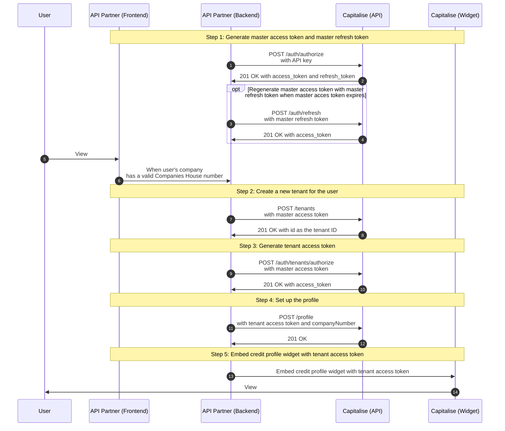

import Tabs from "@theme/Tabs";
import TabItem from "@theme/TabItem";

Help users improve their finanical health with credit profile information directly from your website.


The widget is responsive to adapt to the space you assign.

## Pre-requisites

To successfully show a widget, the company must be a limited company and have a valid Companies House number.

Therefore it's recommended only show the widget if you have a valid Companies House number.

## Examples

<table className="widget-examples">
  <thead>
    <tr>
      <th>Size</th>
      <th>Min width</th>
      <th>Example</th>
    </tr>
  </thead>
  <tbody>
    <tr>
      <td>Small</td>
      <td>320px</td>
      <td>
        
      </td>
    </tr>
    <tr>
      <td>Medium</td>
      <td>740px</td>
      <td>
        
      </td>
    </tr>
    <tr>
      <td>Large</td>
      <td>1024px</td>
      <td>
        
      </td>
    </tr>
  </tbody>
</table>

## Environments

| Environment | Base URL | Description |
| --- | --- | --- |
| Demo | https://demo.capitalise.com | Get started with test credentials and life-like data |
| Production | https://capitalise.com | Launch your app with unlimited live credentials |

For account setup, please contact our Commercial Director Olly Cummings at [olly@capitalise.com](mailto:olly@capitalise.com).

:::secondary Important

- Data and credentials (e.g. `Logins`, `API Key`, `API Token`) CANNOT be moved between Production and Demo
- Always double check if you've got the right credentials configured before production release

:::

## Setup your account for Capitalise.com

Once you've signed MOU, your Partner Manager will send the invite so that you can complete the registration. If in doubt, please reach out to your Partner Manager.

## Sever-side

On the server-side, you will be calling two sets of APIs:

| API | Base Path | Description |
| --- | --- | --- |
| [Platform V1](/api/platform) | /api/platform/v1 | Generating API Key that unique identifies your application |
| [Marketplace V2](/api/marketplace/v2) | /api/marketplace/v2 | The suite of APIs to create tenants, set up profile and get credit profile |

### Generate `API key`

Generate a `platform access token` using your environment login to Capitalise.com.

<Tabs groupId="widget">
  <TabItem value="demo" label="Demo">

```bash title="Request"
curl --location --request POST 'https://demo.capitalise.com/api/platform/v1/auth/login' \
--header 'Content-Type: application/json' \
--data-raw '{
  # highlight-start
  "email": "YOUR_EMAIL",
  "password": "YOUR_PASSWORD"
  # highlight-end
}'
```

</TabItem>
  <TabItem value="production" label="Production">

```bash title="Request"
curl --location --request POST 'https://capitalise.com/api/platform/v1/auth/login' \
--header 'Content-Type: application/json' \
--data-raw '{
  # highlight-start
  "email": "YOUR_EMAIL",
  "password": "YOUR_PASSWORD"
  # highlight-end
}'
```

  </TabItem>
</Tabs>

Upon Successful 200, you will get the `access_token` in the response.

```json title="Response"
{
    # highlight-start
    "access_token": "eyJhbGciOiJSUz...",
    # highlight-end
    "expires_in": 86400,
    "scope": "read:current_user update:current_user_metadata delete:current_user_metadata create:current_user_metadata create:current_user_device_credentials delete:current_user_device_credentials update:current_user_identities",
    "token_type": "Bearer"
}
```

You can use this `access_token` to generate an `API key` for your application.

<Tabs groupId="widget">
  <TabItem value="demo" label="Demo">

```bash title="Request"
curl --location --request POST 'https://demo.capitalise.com/api/platform/v1/api-key' \
# highlight-start
--header 'Authorization: Bearer eyJhbGciOiJSUz...' \
# highlight-end
--header 'Content-Type: application/json' \
--data-raw '{
    # highlight-start
    "name": "YOUR_API_KEY_NAME",
     # highlight-end
    "scopes": [
        "profile:multiples",
        "profile:read",
        "profile:write",
        "questionnaire:read",
        "questionnaire:write",
        "funding:read",
        "funding:write",
        "insights:read",
        "scoring:read",
        "offline_access"
    ],
}'
```

</TabItem>
  <TabItem value="production" label="Production">

```bash title="Request"
curl --location --request POST 'https://capitalise.com/api/platform/v1/auth/login' \
--header 'Content-Type: application/json' \
--data-raw '{
  # highlight-start
  "email": "YOUR_EMAIL",
  "password": "YOUR_PASSWORD"
  # highlight-end
}'
```

  </TabItem>
</Tabs>

Upon Successful 200, you will get your `API Key` in the response.

```json title="Response"
{
  "key": "e6b6fefbd0c0762ab707c211923781985651a47ad323b0faec1d5ed58996026e40"
}
```

:::caution

Please securely store your API key and do not share your with anyone as it's your credential to access Capitalise

:::

### Generate Marketplace `master access token`

To generate your `API Key`, you would need to use the platform `access_token` as your bearer token.

<Tabs groupId="widget">
  <TabItem value="demo" label="Demo">

```bash title="Request"
curl --location --request POST 'https://demo.capitalise.com/api/platform/v1/api-key' \
# highlight-start
--header 'Authorization: Bearer eyJhbG...{{PLATFORM_ACCESS_TOKEN}}...puwv4f2KGadrMwq681u_RQ' \
# highlight-end
--header 'Content-Type: application/json' \
--data-raw '{
    # highlight-start
    "name": "Widget testing", # This string needs to be unique
    # highlight-end
    "scopes": [
        "profile:multiples",
        "profile:read",
        "profile:write",
        "questionnaire:read",
        "questionnaire:write",
        "funding:read",
        "funding:write",
        "insights:read",
        "scoring:read",
        "offline_access"
    ],
    "expiresAt": "2022-07-26T13:29:11.631Z"
}'
```

  </TabItem>
  <TabItem value="production" label="Production">

```bash title="Request"
curl --location --request POST 'https://capitalise.com/api/platform/v1/api-key' \
# highlight-start
--header 'Authorization: Bearer eyJhbG...{{PLATFORM_ACCESS_TOKEN}}...puwv4f2KGadrMwq681u_RQ' \
# highlight-end
--header 'Content-Type: application/json' \
--data-raw '{
    # highlight-start
    "name": "Widget testing", # This string needs to be unique
    # highlight-end
    "scopes": [
        "profile:multiples",
        "profile:read",
        "profile:write",
        "questionnaire:read",
        "questionnaire:write",
        "funding:read",
        "funding:write",
        "insights:read",
        "scoring:read",
        "offline_access"
    ],
    "expiresAt": "2022-07-26T13:29:11.631Z"
}'
```

  </TabItem>
</Tabs>

Now we move onto Marketplace APIs to generate `master access token`. You will need to use your `API Key` to do this.

```bash title="Request"
curl --location --request POST 'https://bravo.dev.capitalise.com/api/marketplace/v2/auth/authorize' \
# highlight-start
--header 'X-API-Key: e6b6fefbd0c0762ab707c211923781b86f51a47ad323b0faec1d5ed58996026e40'
# highlight-end
```

Upon Successful 201, you will get two Marketplace tokens:

- `access_token`: This is the token that you will use to access the Marketplace API. It will expire in 10 hours. You can use this token to access `/tenants`; but it will not be able to acccess `/profile`.
- `refresh_token`: This is the token that allow you refresh your `access_token` without using an `API Key` for extra security. This token will be expired once you've used it to refresh `access_token.

```json title="Response"
{
  "access_token": "eyJhbGciO...{{MARKETPLACE_MASTER_ACCESS_TOKEN}}...V0GiDrY9sVzbZjQMDc1znR77Q",
  "expires_in": 36000,
  "refresh_token": "eyJhbGciO...{{MARKETPLACE_MASTER_REFRESH_TOKEN}}...zfoV3Ek3RxZZOSIl_IvULkIA",
  "scope": "profile:multiples profile:read profile:write questionnaire:read questionnaire:write funding:read funding:write insights:read scoring:read offline_access",
  "token_type": "Bearer"
}
```

### Create a tenant

Now we move onto Marketplace APIs to generate `master access token`. You will need to use your `API Key` to do this.

<Tabs groupId="widget">
  <TabItem value="demo" label="Demo">

```bash title="Request"
curl --location --request POST 'https://demo.capitalise.com/api/marketplace/v2/tenants' \
--header 'Authorization: Bearer eyJhbGciO...{{MARKETPLACE_MASTER_ACCESS_TOKEN}}...V0GiDrY9sVzbZjQMDc1znR77Q' \
--header 'Content-Type: application/json' \
--data-raw '{
    "referenceId": "Unique Tenant ID" # Optional but recommended - needs to be unique
}'
```

  </TabItem>
  <TabItem value="production" label="Production">

```bash title="Request"
curl --location --request POST 'https://capitalise.com/api/marketplace/v2/tenants' \
--header 'Authorization: Bearer eyJhbGciO...{{MARKETPLACE_MASTER_ACCESS_TOKEN}}...V0GiDrY9sVzbZjQMDc1znR77Q' \
--header 'Content-Type: application/json' \
--data-raw '{
    "referenceId": "Unique Tenant ID" # Optional but recommended - needs to be unique
}'
```

  </TabItem>
</Tabs>

Upon Successful 201, you will get the tenant ID.

```json title="Response"
{
  {/* highlight-start */}
  "id": "5ccaa9ba-e3d4-4c1b-865a-26ac02c2717d",
  {/* highlight-end */}
  "referenceId": "Unique Tenant ID",
  "createdDateTime": "2022-04-25T00:16:28.000Z",
  "updatedDateTime": "2022-04-25T00:16:28.000Z"
}
```

### Genenrate `tenant access token`

Once a tenant is created, you can generate a `tenant access token` to manage the tenant.

<Tabs groupId="widget">
  <TabItem value="demo" label="Demo">

```bash title="Request"
curl --location --request POST 'https://demo.capitalise.com/api/marketplace/v2/auth/tenants/authorize' \
# highlight-start
--header 'Capitalise-tenant-id: 5ccaa9ba-e3d4-4c1b-865a-26ac02c2717d' \
--header 'Authorization: Bearer eyJhbGciO...{{MARKETPLACE_MASTER_ACCESS_TOKEN}}...3Fj_LK_-V0GiDrY9sVzbZjQMDc1znR77Q'
# highlight-end
```

  </TabItem>
  <TabItem value="production" label="Production">

```bash title="Request"
curl --location --request POST 'https://capitalise.com/api/marketplace/v2/auth/tenants/authorize' \
# highlight-start
--header 'Capitalise-tenant-id: 5ccaa9ba-e3d4-4c1b-865a-26ac02c2717d' \
--header 'Authorization: Bearer eyJhbGciO...{{MARKETPLACE_MASTER_ACCESS_TOKEN}}...3Fj_LK_-V0GiDrY9sVzbZjQMDc1znR77Q'
# highlight-end
```

  </TabItem>
</Tabs>

Upon Successful 201, you will get the tenant `access_token`.

```json title="Response"
{
  "access_token": "eyJhbGciOi...{{MARKETPLACE_TENANT_ACCESS_TOKEN}}...tRtpiO1aayuWslZ3_ssOQ5rxqGOYZQooBDICrJGVHcF2gg",
  "expires_in": 36000,
  "scope": "profile:read profile:write sign_up",
  "token_type": "Bearer"
}
```

### Set up profile

Now you can set up the profile for the tenant. The widget only need a valid Companies House number.

<Tabs groupId="widget">
  <TabItem value="demo" label="Demo">

```bash title="Request"
curl --location --request POST 'https://demo.capitalise.com/api/marketplace/v2/profile' \
      # highlight-start
--header 'Authorization: Bearer eyJhbGciOi...{{MARKETPLACE_TENANT_ACCESS_TOKEN}}...tRtpiO1aayuWslZ3_ssOQ5rxqGOYZQooBDICrJGVHcF2gg' \
      # highlight-end
--header 'Content-Type: application/json' \
--data-raw '{
    "companyInformation": {
      # highlight-start
        "registrationNumber": "11391321"
      # highlight-end
    }
}'
```

  </TabItem>
  <TabItem value="production" label="Production">

```bash title="Request"
curl --location --request POST 'https://capitalise.com/api/marketplace/v2/profile' \
      # highlight-start
--header 'Authorization: Bearer eyJhbGciOi...{{MARKETPLACE_TENANT_ACCESS_TOKEN}}...tRtpiO1aayuWslZ3_ssOQ5rxqGOYZQooBDICrJGVHcF2gg' \
      # highlight-end
--header 'Content-Type: application/json' \
--data-raw '{
    "companyInformation": {
      # highlight-start
        "registrationNumber": "11391321"
      # highlight-end
    }
}'
```

  </TabItem>
</Tabs>

If you get a 201 Successful response, it means you've set up the profile correctly for the tenant.

## Client-side (mobile app or webapp)

Now the exciting part - we will show the widget on the client-side so your end-user can see the credit profile at your site.

### Embed widget using JavaScript

By using JavaScript, you will be able to catch erros from the UI.

Add the following script before `</body>` tag. The script will look for the element with class name `capFundingSearch` and will create the widget within the element.

<Tabs groupId="widget">
<TabItem value="demo" label="Demo">

```html
<script>
  !(function (e, t, n, i, a, c, s) {
    (e[(a = a || "capitalise")] =
      e[a] ||
      function () {
        (e[a].q = e[a].q || []).push(arguments);
      }),
      (e[a].l = 1 * new Date()),
      (c = t.createElement(n)),
      (s = t.getElementsByTagName(n)[0]),
      (c.id = a),
      (c.src = "https://demo.capitalise.com/app/ui/widget/widget.js"),
      (c.async = 1),
      s.parentNode.insertBefore(c, s);
  })(window, document, "script");
  capitalise("init", {
    element: ".capFundingSearch",
    // highlight-next-line
    accessToken: "REPLACE_WITH_TENANT_ACCESS_TOKEN",
    onError: console.error,
  });
</script>
```

</TabItem>
<TabItem value="production" label="Production">

```html
<script>
  !(function (e, t, n, i, a, c, s) {
    (e[(a = a || "capitalise")] =
      e[a] ||
      function () {
        (e[a].q = e[a].q || []).push(arguments);
      }),
      (e[a].l = 1 * new Date()),
      (c = t.createElement(n)),
      (s = t.getElementsByTagName(n)[0]),
      (c.id = a),
      (c.src = "https://capitalise.com/app/ui/widget/widget.js"),
      (c.async = 1),
      s.parentNode.insertBefore(c, s);
  })(window, document, "script");
  capitalise("init", {
    element: ".capFundingSearch",
    // highlight-next-line
    accessToken: "REPLACE_WITH_MARKETPLACE_TENANT_ACCESS_TOKEN",
    onError: console.error,
  });
</script>
```

</TabItem>

</Tabs>

Create an empty `div` with `capitalise` class at the place you want to show the widget.

```HTML
<div class="capFundingSearch"></div>
```

### Embed widget using iframe

Alternatively, you can embed the widget using an iframe. The implementation is simplerl; but you won't be able to catch errors from the UI.

Insert the following code into your website and replace `TENANT_ACCESS_TOKEN` with your tenant access token. Also, change the `height` and `width` to match your needs.

<Tabs groupId="widget">
  <TabItem value="demo" label="Demo">

<!-- prettier-ignore-start -->

```html
<iframe
  <!-- highlight-start -->
  src="https://demo.capitalise.com/app/ui/widget/embed.html?accessToken=REPLACE_WITH_MARKETPLACE_TENANT_ACCESS_TOKEN"
  height="320px"
  width="100%"
  <!-- highlight-end -->
  title="Credit profile"
  frameborder="0"
  scrolling="no" />
````

<!-- prettier-ignore-end -->

  </TabItem>
  <TabItem value="production" label="Production">

<!-- prettier-ignore-start -->

```html
<iframe
  <!-- highlight-start -->
  src="https://capitalise.com/app/ui/widget/embed.html?accessToken=REPLACE_WITH_MARKETPLACE_TENANT_ACCESS_TOKEN"
  height="320px"
  width="100%"
  <!-- highlight-end -->
  title="Credit profile"
  frameborder="0"
  scrolling="no" />
```
<!-- prettier-ignore-end -->

  </TabItem>
</Tabs>

## High-level sequence diagram


