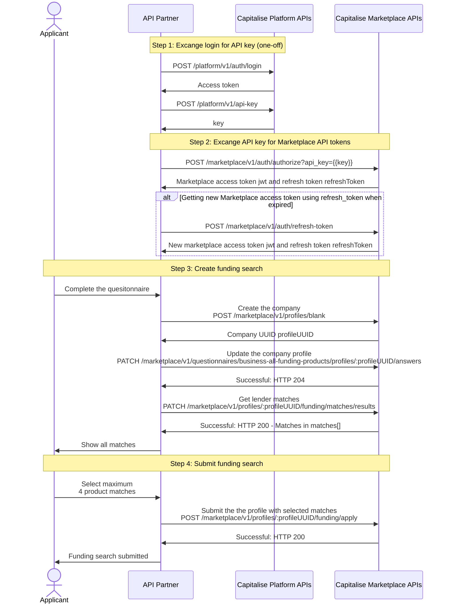

Design your own native journey to help user find funding from over 100 lenders

## Environments

| Environment | Base URL | Description |
| --- | --- | --- |
| Demo | https://demo.capitalise.com/api/business/v1 | Get started with test credentials and life-like data |
| Production | https://capitalise.com/api/business/v1 | Launch your app with live credentials |

For account setup, please contact our API Partner Manager Sabrin Ghomri at [sabrin.ghomri@capitalise.com](mailto:sabrin.ghomri@capitalise.com).

:::info Important

- Data CANNOT be moved between Production and Demo
- Credentials (e.g. `Logins`, `API Key`, `API Token`) are NOT sharable between Production and Demo
- Always double check if you've got the right credentials configured before production release

:::

You will be using two suites of APIs to implement the native funding search journey at your end:

| API | Base Path | Description |
| --- | --- | --- |
| [Platform V1](/api/platform) | /api/platform/v1 | Generating API Key that unique identifies your application |
| [Marketplace V1](/api/marketplace/v1) | /api/marketplace/v1 | Create and submit funding searches to Capitalise |

## High-level sequence diagram

